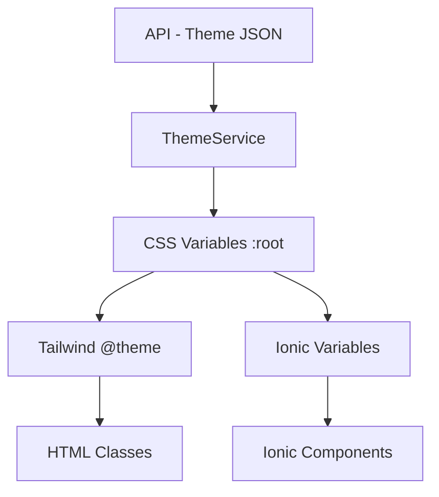

# Dynamic Theme từ API với Ionic + Tailwind CSS v4

Hướng dẫn **load màu (theme) từ API và apply runtime** cho ứng dụng **Ionic + Angular + Tailwind CSS v4**, không cần rebuild app.

## 📌 Use Cases

✅ Multi-tenant / SaaS apps
✅ White-label applications  
✅ Dynamic branding per customer
✅ Dark mode / User preferences
✅ A/B testing themes

---

## 🎯 Vấn đề & Giải pháp

### Vấn đề

- Ionic sử dụng **CSS Variables** (`--ion-color-*`)
- Tailwind v4 không dùng `tailwind.config.js` nữa
- Tailwind v4 dùng **CSS-first config** (`@theme {}`)
- Cần đổi màu **runtime** mà không rebuild

### Giải pháp

➡️ **CSS Variables = Single Source of Truth**

```
API Theme → CSS Variables → Tailwind @theme → Ionic Components
```

---

## 🏗️ Kiến trúc



---

## 📁 Cấu trúc Files

```
src/
├── input.css                 # Tailwind config với @theme
├── theme/
│   └── variables.scss        # Ionic variables
├── app/
│   └── services/
│       └── theme.service.ts  # Theme runtime service
└── environments/
    └── environment.ts        # API endpoints
```

---

## 1️⃣ Setup Tailwind v4 với Dynamic Variables

### `src/input.css`

```css
@import "tailwindcss";
@import "tailwindcss-animated";

/* Theme sử dụng CSS Variables từ :root */
@theme {
  /* Brand colors - reference CSS variables */
  --color-primary: var(--app-primary);
  --color-primary-foreground: var(--app-primary-foreground);
  --color-secondary: var(--app-secondary);
  --color-secondary-foreground: var(--app-secondary-foreground);
  
  /* State colors */
  --color-success: var(--app-success);
  --color-warning: var(--app-warning);
  --color-danger: var(--app-danger);
  --color-info: var(--app-info);
  
  /* Neutral colors */
  --color-background: var(--app-background);
  --color-foreground: var(--app-foreground);
  --color-muted: var(--app-muted);
  --color-border: var(--app-border);
}

/* Base layer - Default theme values */
@layer base {
  :root {
    /* Default brand colors (fallback) */
    --app-primary: #04aca3;
    --app-primary-foreground: #ffffff;
    --app-secondary: #07746e;
    --app-secondary-foreground: #ffffff;
    
    /* Default state colors */
    --app-success: #16a34a;
    --app-warning: #f59e0b;
    --app-danger: #dc2626;
    --app-info: #3b82f6;
    
    /* Default neutral colors */
    --app-background: #ffffff;
    --app-foreground: #0c1420;
    --app-muted: #f1f5f9;
    --app-border: #e2e8f0;
    
    /* Ionic color mapping */
    --ion-color-primary: var(--app-primary);
    --ion-color-primary-rgb: 4, 172, 163;
    --ion-color-primary-contrast: var(--app-primary-foreground);
    
    --ion-color-secondary: var(--app-secondary);
    --ion-color-secondary-rgb: 7, 116, 110;
    --ion-color-secondary-contrast: var(--app-secondary-foreground);
    
    --ion-color-success: var(--app-success);
    --ion-color-success-rgb: 22, 163, 74;
    
    --ion-color-warning: var(--app-warning);
    --ion-color-warning-rgb: 245, 158, 11;
    
    --ion-color-danger: var(--app-danger);
    --ion-color-danger-rgb: 220, 38, 38;
  }
  
  /* Dark mode (optional) */
  :root[data-theme='dark'] {
    --app-primary: #06d6a0;
    --app-background: #0c1420;
    --app-foreground: #ffffff;
    --app-muted: #1e293b;
    --app-border: #334155;
  }
}
```

**Key points:**
- `@theme {}` reference CSS variables (`var(--app-*)`)
- Fallback values trong `@layer base`
- Ionic colors map tới same variables

---

## 2️⃣ Ionic Variables Sync

### `src/theme/variables.scss`

```scss
:root {
  // Primary color
  --ion-color-primary: var(--app-primary);
  --ion-color-primary-contrast: var(--app-primary-foreground);
  --ion-color-primary-shade: color-mix(in srgb, var(--app-primary) 80%, black);
  --ion-color-primary-tint: color-mix(in srgb, var(--app-primary) 80%, white);

  // Secondary color
  --ion-color-secondary: var(--app-secondary);
  --ion-color-secondary-contrast: var(--app-secondary-foreground);
  --ion-color-secondary-shade: color-mix(in srgb, var(--app-secondary) 80%, black);
  --ion-color-secondary-tint: color-mix(in srgb, var(--app-secondary) 80%, white);

  // Success
  --ion-color-success: var(--app-success);
  --ion-color-success-contrast: #ffffff;
  
  // Warning
  --ion-color-warning: var(--app-warning);
  --ion-color-warning-contrast: #000000;
  
  // Danger
  --ion-color-danger: var(--app-danger);
  --ion-color-danger-contrast: #ffffff;
  
  // Background & text
  --ion-background-color: var(--app-background);
  --ion-text-color: var(--app-foreground);
}
```

**Lưu ý:** Ionic và Tailwind dùng **cùng CSS variables** → hoàn toàn đồng bộ!

---

## 3️⃣ API Theme Response

### Example API Response

```json
{
  "tenant": "acme-corp",
  "theme": {
    "primary": "#2563eb",
    "primaryForeground": "#ffffff",
    "secondary": "#f59e0b",
    "secondaryForeground": "#000000",
    "success": "#16a34a",
    "warning": "#f59e0b",
    "danger": "#dc2626",
    "info": "#3b82f6",
    "background": "#ffffff",
    "foreground": "#0c1420",
    "muted": "#f1f5f9",
    "border": "#e2e8f0"
  }
}
```

### TypeScript Interface

```typescript
export interface ThemeConfig {
  primary: string;
  primaryForeground: string;
  secondary: string;
  secondaryForeground: string;
  success: string;
  warning: string;
  danger: string;
  info: string;
  background: string;
  foreground: string;
  muted: string;
  border: string;
}

export interface TenantTheme {
  tenant: string;
  theme: ThemeConfig;
}
```

---

## 4️⃣ ThemeService - Apply Runtime

### `src/app/services/theme.service.ts`

```typescript
import { Injectable } from '@angular/core';
import { HttpClient } from '@angular/common/http';
import { BehaviorSubject, Observable, firstValueFrom } from 'rxjs';

export interface ThemeConfig {
  primary: string;
  primaryForeground: string;
  secondary: string;
  secondaryForeground: string;
  success: string;
  warning: string;
  danger: string;
  info: string;
  background: string;
  foreground: string;
  muted: string;
  border: string;
}

@Injectable({
  providedIn: 'root'
})
export class ThemeService {
  private currentTheme$ = new BehaviorSubject<ThemeConfig | null>(null);
  private readonly STORAGE_KEY = 'app-theme';
  
  constructor(private http: HttpClient) {}

  /**
   * Load theme from API
   */
  async loadThemeFromAPI(tenantId?: string): Promise<ThemeConfig> {
    const url = tenantId 
      ? `/api/themes/${tenantId}` 
      : '/api/themes/default';
    
    const response = await firstValueFrom(
      this.http.get<{ theme: ThemeConfig }>(url)
    );
    
    const theme = response.theme;
    this.applyTheme(theme);
    this.cacheTheme(theme);
    
    return theme;
  }

  /**
   * Apply theme to document root
   */
  applyTheme(theme: ThemeConfig): void {
    const root = document.documentElement;

    // Brand colors
    this.setCSSVar(root, 'primary', theme.primary);
    this.setCSSVar(root, 'primary-foreground', theme.primaryForeground);
    this.setCSSVar(root, 'secondary', theme.secondary);
    this.setCSSVar(root, 'secondary-foreground', theme.secondaryForeground);

    // State colors
    this.setCSSVar(root, 'success', theme.success);
    this.setCSSVar(root, 'warning', theme.warning);
    this.setCSSVar(root, 'danger', theme.danger);
    this.setCSSVar(root, 'info', theme.info);

    // Layout colors
    this.setCSSVar(root, 'background', theme.background);
    this.setCSSVar(root, 'foreground', theme.foreground);
    this.setCSSVar(root, 'muted', theme.muted);
    this.setCSSVar(root, 'border', theme.border);

    // Update RGB values for Ionic
    this.updateIonicRGB(root, 'primary', theme.primary);
    this.updateIonicRGB(root, 'secondary', theme.secondary);
    this.updateIonicRGB(root, 'success', theme.success);
    this.updateIonicRGB(root, 'warning', theme.warning);
    this.updateIonicRGB(root, 'danger', theme.danger);

    this.currentTheme$.next(theme);
  }

  /**
   * Load cached theme from localStorage
   */
  loadCachedTheme(): ThemeConfig | null {
    try {
      const cached = localStorage.getItem(this.STORAGE_KEY);
      if (cached) {
        const theme = JSON.parse(cached);
        this.applyTheme(theme);
        return theme;
      }
    } catch (error) {
      console.error('Failed to load cached theme:', error);
    }
    return null;
  }

  /**
   * Cache theme to localStorage
   */
  private cacheTheme(theme: ThemeConfig): void {
    try {
      localStorage.setItem(this.STORAGE_KEY, JSON.stringify(theme));
    } catch (error) {
      console.error('Failed to cache theme:', error);
    }
  }

  /**
   * Set CSS variable on root element
   */
  private setCSSVar(root: HTMLElement, name: string, value: string): void {
    root.style.setProperty(`--app-${name}`, value);
  }

  /**
   * Convert hex to RGB and update Ionic color variables
   */
  private updateIonicRGB(root: HTMLElement, colorName: string, hex: string): void {
    const rgb = this.hexToRgb(hex);
    if (rgb) {
      root.style.setProperty(
        `--ion-color-${colorName}-rgb`, 
        `${rgb.r}, ${rgb.g}, ${rgb.b}`
      );
    }
  }

  /**
   * Convert hex color to RGB
   */
  private hexToRgb(hex: string): { r: number; g: number; b: number } | null {
    const result = /^#?([a-f\d]{2})([a-f\d]{2})([a-f\d]{2})$/i.exec(hex);
    return result ? {
      r: parseInt(result[1], 16),
      g: parseInt(result[2], 16),
      b: parseInt(result[3], 16)
    } : null;
  }

  /**
   * Get current theme as observable
   */
  getCurrentTheme(): Observable<ThemeConfig | null> {
    return this.currentTheme$.asObservable();
  }

  /**
   * Toggle dark mode
   */
  toggleDarkMode(isDark: boolean): void {
    document.documentElement.dataset['theme'] = isDark ? 'dark' : 'light';
  }
}
```

---

## 5️⃣ App Initialization - Load Theme Early

### `src/app/app.component.ts`

```typescript
import { Component, OnInit } from '@angular/core';
import { ThemeService } from './services/theme.service';
import { CredentialService } from './shared/services/credential-service/credential.service';

@Component({
  selector: 'app-root',
  templateUrl: 'app.component.html'
})
export class AppComponent implements OnInit {
  constructor(
    private themeService: ThemeService,
    private credentialService: CredentialService
  ) {}

  async ngOnInit() {
    // 1. Load cached theme immediately (prevent flash)
    this.themeService.loadCachedTheme();

    // 2. Load theme from API after user login
    const user = await this.credentialService.getCurrentUser();
    if (user?.tenantId) {
      try {
        await this.themeService.loadThemeFromAPI(user.tenantId);
      } catch (error) {
        console.error('Failed to load theme from API:', error);
      }
    }
  }
}
```

**Flow:**
1. Load cached theme ngay lập tức → tránh flash
2. Load theme từ API sau khi có user/tenant
3. Cache lại theme mới

---

## 6️⃣ Sử dụng trong UI

### Tailwind Classes

```html
<!-- Brand colors -->
<div class="bg-primary text-primary-foreground">
  Primary Button
</div>

<div class="bg-secondary text-secondary-foreground">
  Secondary Button
</div>

<!-- State colors -->
<div class="text-success">Success message</div>
<div class="text-danger">Error message</div>
<div class="bg-warning text-black">Warning banner</div>

<!-- With opacity -->
<div class="bg-primary/80">Semi-transparent</div>

<!-- Borders -->
<div class="border border-primary">Bordered</div>
```

### Ionic Components

```html
<!-- Buttons -->
<ion-button color="primary">Primary</ion-button>
<ion-button color="secondary">Secondary</ion-button>

<!-- Badges -->
<ion-badge color="success">Success</ion-badge>
<ion-badge color="danger">Error</ion-badge>

<!-- Cards -->
<ion-card color="primary">
  <ion-card-content>Card content</ion-card-content>
</ion-card>

<!-- Inputs -->
<ion-input color="primary"></ion-input>
```

**Result:** Ionic và Tailwind **hoàn toàn đồng bộ màu!**

---

## 7️⃣ Advanced Features

### Dark Mode Toggle

```typescript
// In component
toggleDark(isDark: boolean) {
  this.themeService.toggleDarkMode(isDark);
}
```

```css
/* In input.css */
:root[data-theme='dark'] {
  --app-primary: #06d6a0;
  --app-background: #0c1420;
  --app-foreground: #ffffff;
}
```

### Multi-Tenant Switcher

```typescript
async switchTenant(tenantId: string) {
  await this.themeService.loadThemeFromAPI(tenantId);
  // Reload app or navigate
}
```

### Theme Preview (Admin)

```typescript
previewTheme(theme: ThemeConfig) {
  this.themeService.applyTheme(theme);
  // Don't cache, just preview
}
```

---

## 8️⃣ Troubleshooting

### Vấn đề: Tailwind class không đổi màu

**Nguyên nhân:** Không dùng CSS variables trong `@theme {}`

**Fix:**
```css
@theme {
  --color-primary: var(--app-primary); /* ✅ Đúng */
  /* --color-primary: #04aca3; ❌ Sai - hardcode */
}
```

### Vấn đề: Ionic đổi màu, Tailwind không

**Nguyên nhân:** Không map chung CSS variables

**Fix:** Đảm bảo cả hai dùng `var(--app-*)`

### Vấn đề: Flash màu lúc load app

**Nguyên nhân:** Apply theme quá muộn

**Fix:** Load cached theme trong `AppComponent.ngOnInit()` càng sớm càng tốt

### Vấn đề: RGB values sai cho Ionic

**Nguyên nhân:** Không convert hex → RGB

**Fix:** Dùng `hexToRgb()` trong ThemeService

---

## 9️⃣ Best Practices

✅ **Load cached theme immediately** trong app init
✅ **Validate theme values** từ API (fallback to defaults)
✅ **Use CSS Variables** làm single source of truth
✅ **Don't hardcode colors** trong components
✅ **Cache theme per tenant/user**
✅ **Provide fallback theme** nếu API fail
✅ **Update Ionic RGB values** khi đổi màu
✅ **Test dark mode** nếu hỗ trợ

❌ **Don't** chỉnh SCSS files runtime
❌ **Don't** rebuild app khi đổi theme
❌ **Don't** hardcode màu trong `@theme {}`
❌ **Don't** quên cache theme

---

## 🔟 Testing Checklist

- [ ] Load cached theme ngay lúc app start
- [ ] API theme override cached theme
- [ ] Tailwind classes (`bg-primary`) đổi màu
- [ ] Ionic components (`color="primary"`) đổi màu
- [ ] Dark mode toggle hoạt động
- [ ] Theme persist sau khi reload app
- [ ] Fallback theme nếu API fail
- [ ] RGB values đúng cho Ionic
- [ ] No color flash on app load
- [ ] Multi-tenant switching works

---

## 📚 Files Summary

```
src/
├── input.css                      # Tailwind @theme với CSS vars
├── theme/
│   └── variables.scss             # Ionic variables (sync với CSS vars)
├── app/
│   ├── app.component.ts           # Load theme on init
│   └── services/
│       └── theme.service.ts       # Theme runtime service
└── environments/
    └── environment.ts             # API config
```

---

## 🎉 Kết quả

✅ Theme load từ API **không cần rebuild**
✅ Ionic & Tailwind **hoàn toàn đồng bộ**
✅ Dark mode / Multi-tenant **ready**
✅ Cache theme **tránh flash**
✅ Production-ready & scalable

---

## 🚀 Next Steps

- [ ] Theme builder UI cho admin
- [ ] A/B testing themes
- [ ] Analytics tracking theme changes
- [ ] Theme animation transitions
- [ ] Per-component theme overrides
- [ ] Theme marketplace

---

**Happy theming! 🎨**
